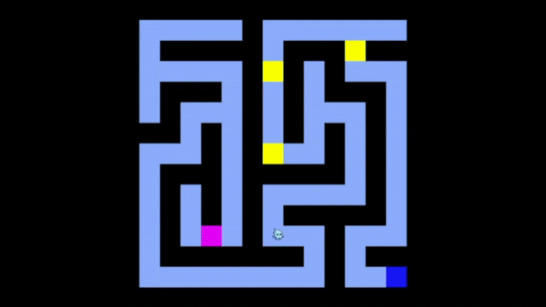

# qGhast

A maze runner game for teaching quantum error correction.



Use the arrow keys to move the blue ghost, which represents a qubit. The red and green ghosts represent Pauli X and Z errors, and the yellow and magneta blocks represent stabilizers. Touching the stabilizers will "heal" the damage caused by the error ghosts. Find your way to the blue square (a measure qubit) to win!

## Development

```sh
$ npm run dev
```

will start a dev server at http://localhost:8000

## Distribution

```sh
$ npm run build
```

will build your js files into `www/main.js`
